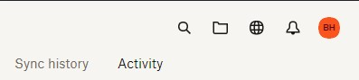
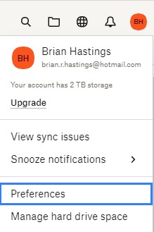
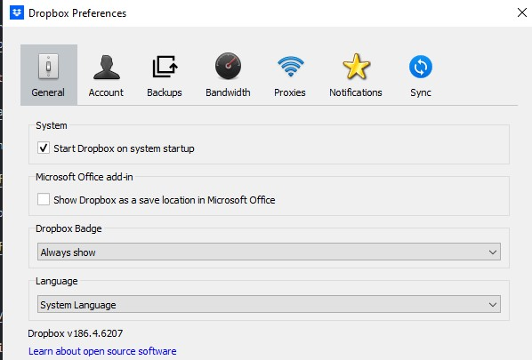
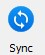
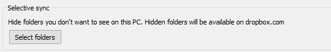
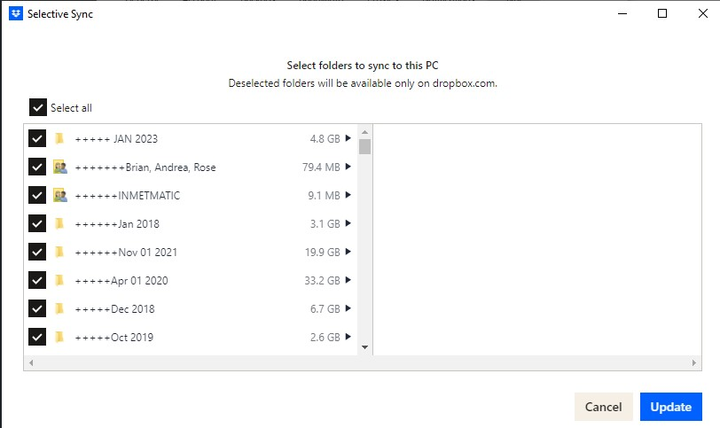

## Remove Local Files in Dropbox

Remove files from local computer in Dropbox but do ***NOT*** remove them from Dropbox online.

Open Dropbox desktop app preferences. Select Dropbox Icon in the taskbar 

Select avatar (profile picture or initials)

Select Preferences from menu.

 The preferences dialogue opens.

Select the sync tab. 

In Selective Sync area, click on Select Folders

Dialogue opens showing all folders in Dropbox. 

Deselect folders that want only available online and select Update.

All selected folders have a local copy on Local PC. All deselected folders are only kept on dropbox.com

