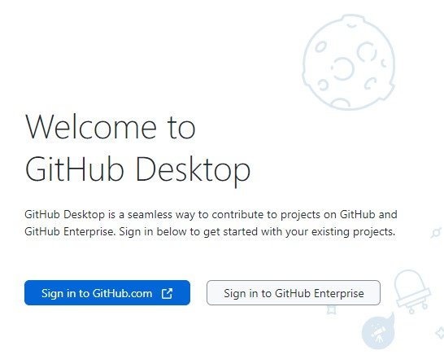

## Clone from github.com to Local PC - initial Setup

Create a folder on local PC that will hold the repo from github.com. After cloning is complete, a new folder will be placed here as part of the clone process.

## Install GitHub Desktop on Local PC

GitHub desktop needs to be installed on local PC

Go to:
[download GitHub Desktop](https://desktop.github.com/)

Select Download for Windows (64bit) and run exe file. GitHub desktop will open, Select Sign in to GitHub.com

Dialogue opens to configure GitHub - specify how to login, use gmail for login then select finish.

## Clone Repository after Initial Installation

Let's get started dialogue opens.

Select clone a repository from the internet. Clone a repository dialogue opens.

Select the repository to clone from GitHub.com.

In Local Path click on "choose" and select the folder where the repo will be created. After Cloning, a folder with the repo name from github.com will be created. This folder ***CANNOT*** exist before cloning - it will be created automatically.

After choosing the local path select "Clone". 

The first time Windows Security may prevent folder access and Clone failed may appear.

When the windows security popup appears, select it and allow access. The click on Retry clone. The Cloning process starts and the Cloning dialogue opens during the cloning process.

A local folder with the repo name will be created and the Repo will show in GitHub Desktop.

Select the option to Open in Visual Studio code. VSCode opens with the repo that has been cloned from github.com.

## Clone a Different Repo from Internet After Setup Complete

To clone a different repo from the internet after GitHub desktop was previously setup, open GitHub Desktop.

On the file menu select Clone repository

The Clone a Repository dialogue opens as described above. 

Choose a repository and a new local path where the repository will be created.

## Open a Repository Folder in VSCode

Right click on the repository folder and select Open with Code from the Context Menu

As an alternative, open the repository folder. In the address bar type cmd and press enter. A command prompt will open pointed at this folder.

At the command prompt type: "code", a space and a period and press enter.

End of document

