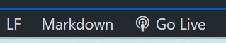
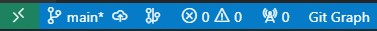
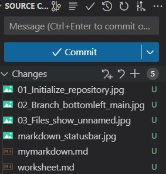
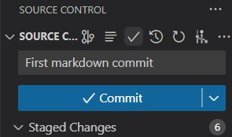

<h1 align="center"> VSCode Markdown Summary </h1>

- [Create Markdown File](#create-markdown-file)
- [Preview Markdown File](#preview-markdown-file)
- [VSCode extension](#vscode-extension)
  - [... Create VSCode TOC](#-create-vscode-toc)
- [Chrome extension](#chrome-extension)
- [Inline images](#inline-images)
- [Image size control](#image-size-control)
- [Tables with long text in each cell](#tables-with-long-text-in-each-cell)
- [Use Tables to render text beside an image](#use-tables-to-render-text-beside-an-image)
## Create Markdown File
Create a new file with the extension .md - Shows Markdown in bottom status bar at left -- 

## Preview Markdown File

To Preview markdown file - ***Ctrl-K*** followed by letter ***"v"***

## VSCode extension

Markdown All in One, v3.5.1, Yu Zhang, 7,434,057. How do get commands to run from command pallet? 

### ... Create VSCode TOC

Place cursor a place in file where want TOC to be inserted.

Run command "Create Table of Contents" (in the VS Code Command Palette) to insert a new table of contents ...
Open command pallet with Ctrl-Shift-P. In command pallet, type "Create Table of Contents"

## Chrome extension

An extension for chrome or edge is: 
[Markdown Viewer](https://chrome.google.com/webstore/detail/markdown-viewer/ckkdlimhmcjmikdlpkmbgfkaikojcbjk). Drag .md file into browser window to see.
To set options, select Extensions button on browser toolbar, Manage extensions, one Markdown Viewer extension select Details link, Select: "Allow access to File URLs"

TOC generated using VSCode extension "Markdown All in One" works with this chrome extension.


## Inline images

Place an image using  after text with no line break and image in rendered inline. Problem is rendered image size is determined by actual image and if tall, can change line height of inline text.

***<u>Markdown:</u>***

```
Create a new file with the extension .md - Shows Markdown in bottom status bar at left  
```

***<u>Renders:</u>***

Create a new file with the extension .md - Shows Markdown in bottom status bar at left  

## Image size control

Can replace markdown `````` with:

***<u>Markdown:</u>***

```  ```

***<u>Renders:</u>***

Inline text before image --  --size controlled by width property.

## Tables with long text in each cell

Can leave the top table row (headings) blank with only the pipes, will preserve the table structure. Long items will be be rendered in each column. The width of each column will be proportional to the string length in each column.
Can add a blank column to provide space between the columns.

***<u>Long text Markdown:</u>***
```
| | | |
|-----|---|-----|
| This column renders wider because the text string  is a lot longer than the text string in the other column | | This string is a lot shorter.|
```
***<u>Renders:</u>***

| | | |
|-----|---|-----|
| This column renders wider because the text string  is a lot longer than the text string in the other column | This string is a lot shorter compared to col 1|

## Use Tables to render text beside an image

Use img tag in a table to place text beside an image; control the size with the width parameter

***<u>Markdown:</u>***
```markdown
|  | |
|-----|-----|
|This is some text that you want to have next to an image. Control the image size by adjusting the image width property.|  |
```

***<u>Renders:</u>***
|  | |
|-----|-----|
|This is some text that you want to have next to an image. Control the image size by adjusting the image width property.|  |

## Git-hub Setup and Use

### Initialize folder to reflect repository

1. Open VSCode in folder that will sync with remote repository
2. Select Source Control Icon - Left side toolbar


After initialize, branch at bottom left shows main



To change name to something different, open command pallet with shift-Cmd-P and type Rename Branch, enter new name and new name shows at lower left in place of main.


In source control, files show with "U" to indicate unstaged


Select "+" beside "Changes" to add all to staging area or the "+" beside the individual files to stage one file. "U" changes to "A" to indicated has been added to staging area.

To commit, add a message describing the change that is being committed.


Select check mark above commit description, to commit.  This commits locally. After commit with the check mark, will see a button to publish the commit to GitHub. Click allow on dialogue, authorization process starts, give GitHub permission to open VSCode. Choose repository type as public, then can open on GitHub.


